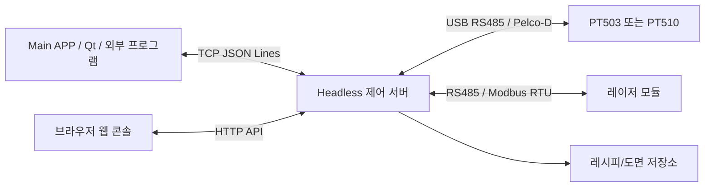

# PT503/PT510 외부 제어 API

문서 버전: 1.1  
대상: Windows / Ubuntu 22.04/24.04 / RDK-X5 arm64, PT503/PT510, Headless HTTP/TCP API

## 1. 전체 구조



서버는 두 가지 인터페이스를 제공합니다.

| 방식 | 기본 포트 | 용도 |
|---|---:|---|
| HTTP | `8080` | 웹 콘솔, 상태 조회, 명령 실행, 도면 파일 업로드 |
| TCP JSON Lines | `8765` | Main APP, Qt/C++ 프로그램, 외부 자동화 연동 |

서버 실행 예:

```bash
python main.py --server --host auto --tcp-host auto
```

## 2. 공통 규칙

| 항목 | 값 |
|---|---|
| 문자 인코딩 | UTF-8 |
| 좌표 단위 | Pan/Tilt는 degree |
| Pan 범위 | `0.0 <= pan <= 359.99` |
| Tilt 범위 | `-60.0 <= tilt <= 60.0` |
| 속도 범위 | `0..63` |
| 프로토콜 이름 | `PT503-Control` |
| 프로토콜 버전 | `1.0` |

일부 위험 명령은 `confirm:true`가 필요합니다. 예: preset 삭제, raw 명령 전송, 공장 초기화.

## 3. HTTP API

### 3.1 상태 조회

```http
GET /api/status
```

현재 연결 상태, 위치, motion 상태, 레이저 상태, 최근 RX 등을 반환합니다.

### 3.2 포트 조회

```http
GET /api/ports
```

서버 PC에서 보이는 serial 포트 목록을 반환합니다.

### 3.3 명령 실행

```http
POST /api/command
Content-Type: application/json

{
  "command": "motion.absolute",
  "params": {
    "pan": 90.0,
    "tilt": 5.0
  }
}
```

성공 응답:

```json
{
  "ok": true,
  "result": {
    "accepted": true
  }
}
```

오류 응답:

```json
{
  "ok": false,
  "error": {
    "code": "INVALID_PARAMS",
    "message": "pan or tilt is required"
  }
}
```

### 3.4 도면 업로드

```http
POST /api/drawings/upload
Content-Type: multipart/form-data
```

폼 필드:

| 이름 | 타입 | 설명 |
|---|---|---|
| `file` | file | 업로드할 도면 파일. 같은 필드를 여러 번 보낼 수 있습니다. |

지원 확장자:

`.stl`, `.stp`, `.step`, `.cad`, `.obj`, `.ply`, `.glb`, `.gltf`

STEP/STP 원본과 같은 기본 이름의 메시 파일을 같이 업로드하면 해당 메시를 웹 표시용으로 우선 사용합니다. 메시 파일이 하나뿐이면 파일명이 달라도 자동 연결합니다. 예: `panel.step` + `panel.glb`.

최대 업로드 크기: `512MB`

성공 응답:

```json
{
  "ok": true,
  "result": {
    "drawing": {
      "id": "uuid",
      "name": "sample.stl",
      "point_count": 0,
      "vertex_count": 12000,
      "face_count": 24000,
      "web_vertex_count": 12000,
      "web_face_count": 24000
    }
  }
}
```

### 3.5 도면 Mesh 조회

```http
GET /api/drawings/{drawing_id}/mesh
```

웹 뷰어용 경량 mesh를 반환합니다.

```json
{
  "version": 1,
  "source": "sample.stl",
  "vertices": [[0.0, 0.0, 0.0]],
  "faces": [[0, 1, 2]],
  "face_colors": [[120, 140, 180]],
  "bounds": {
    "min": [0.0, 0.0, 0.0],
    "max": [100.0, 80.0, 20.0]
  },
  "sampled": false,
  "warnings": []
}
```

## 4. TCP JSON Lines API

TCP는 한 줄에 JSON 객체 하나를 보내고, 줄 끝에 LF(`\n`)를 붙입니다.

연결 직후 서버는 준비 이벤트를 먼저 보냅니다.

```json
{"event":"service.ready","data":{"protocol":"PT503-Control","version":"1.0","client_id":"client-1","mode":"headless"},"timestamp":"2026-09-28T10:20:30+09:00"}
```

요청:

```json
{"id":"move-001","command":"motion.absolute","params":{"pan":90.0,"tilt":5.0}}
```

성공 응답:

```json
{"id":"move-001","ok":true,"result":{"accepted":true,"target":{"pan":90.0,"tilt":5.0}}}
```

오류 응답:

```json
{"id":"move-001","ok":false,"error":{"code":"INVALID_PARAMS","message":"pan or tilt is required"}}
```

TCP 프레임 최대 길이는 `65,536 bytes`입니다. `recv()` 한 번이 메시지 하나라는 보장은 없으므로 수신 버퍼를 모아 `\n` 기준으로 파싱해야 합니다.

## 5. 명령 종류

전체 명령 목록은 아래 명령으로 런타임에서 조회합니다.

```json
{"command":"system.commands","params":{}}
```

템플릿과 enum 목록은 아래 명령으로 조회합니다.

```json
{"command":"protocol.catalog","params":{}}
```

### 5.1 System

| 명령 | 설명 |
|---|---|
| `system.ping` | 프로토콜 버전과 서버 시간을 반환 |
| `system.status` | 전체 상태 조회 |
| `system.commands` | 사용 가능한 명령 목록 조회 |
| `protocol.catalog` | 명령 템플릿과 enum 목록 조회 |

### 5.2 Serial

| 명령 | 주요 파라미터 | 설명 |
|---|---|---|
| `serial.ports` | 없음 | 사용 가능한 포트 목록 |
| `serial.connect` | `port`, `baudrate`, `address`, `auto_reconnect` | PT 장비 연결 |
| `serial.disconnect` | 없음 | PT 장비 연결 해제 |
| `serial.scan` | `baudrates`, `ports`, `first_address`, `last_address`, `timeout_ms` | 장비 자동 검색 |
| `serial.scan_cancel` | 없음 | 검색 취소 |
| `serial.auto_reconnect` | `enabled`, `baudrates`, `first_address`, `last_address`, `retry_interval_s` | 자동 재연결 설정 |

### 5.3 Motion / Position

| 명령 | 주요 파라미터 | 설명 |
|---|---|---|
| `motion.jog` | `pan`, `tilt`, `pan_speed`, `tilt_speed`, `duration_ms` | 수동 조그 |
| `motion.stop` | 없음 | 정지 |
| `motion.absolute` | `pan`, `tilt`, `pan_speed`, `tilt_speed`, `axis_delay_ms` | 절대 위치 이동 |
| `motion.relative` | `pan_delta`, `tilt_delta` | 상대 이동 |
| `motion.completion_config` | `tolerance_deg`, `stable_samples`, `timeout_s` | 목표 도달 판정 설정 |
| `position.get` | `refresh` | 현재 위치 조회 |
| `monitor.set` | `enabled`, `interval_ms` | 주기 위치 모니터링 |

`motion.absolute`의 응답 `accepted:true`는 명령이 전송되었다는 뜻입니다. 실제 목표 도달 여부는 `motion.state`, `position.get`, 모니터링 결과로 확인합니다.

### 5.4 Recipe / Point

| 명령 | 주요 파라미터 | 설명 |
|---|---|---|
| `recipe.list` | 없음 | 레시피 목록 |
| `recipe.upsert` | `recipe_id`, `name`, `description` | 레시피 생성/수정 |
| `recipe.delete` | `recipe_id` | 레시피 삭제 |
| `point.upsert` | `recipe_id`, `point_id`, `name`, `pan`, `tilt`, `pan_speed`, `tilt_speed`, `dwell_ms`, `enabled`, `note` | 포인트 생성/수정 |
| `point.delete` | `recipe_id`, `point_id` | 포인트 삭제 |
| `point.reorder` | `recipe_id`, `ordered_ids` | 포인트 순서 변경 |
| `point.goto` | `recipe_id`, `point_id` | 저장 포인트로 이동 |

## 6. 도면 API

도면 API는 서버에 저장된 도면과 도면 포인트를 관리합니다. 도면 포인트는 레시피 포인트와 별도 데이터이며, 명시적으로 내보내기/불러오기를 할 때만 서로 동기화됩니다.

| 명령 | 주요 파라미터 | 설명 |
|---|---|---|
| `drawing.list` | 없음 | 최근 도면 목록 |
| `drawing.get` | `drawing_id` | 도면 상세와 포인트 목록 |
| `drawing.point_upsert` | `drawing_id`, `point_id`, `label`, `x`, `y`, `z`, `calibration`, `pan`, `tilt` | 도면 포인트 생성/수정 |
| `drawing.point_delete` | `drawing_id`, `point_id` | 도면 포인트 삭제 |
| `drawing.point_reorder` | `drawing_id`, `ordered_ids` | 도면 포인트 순서 변경 |
| `drawing.calibrate` | `drawing_id` | calibration 포인트 기준으로 Pan/Tilt 자동 계산 |
| `drawing.estimate_xy` | `drawing_id`, `pan`, `tilt` | Pan/Tilt 기준 X/Y 좌표 추정 |
| `drawing.export_recipe` | `drawing_id`, `recipe_id` | 도면 포인트를 레시피 포인트로 내보내기 |
| `drawing.import_recipe` | `drawing_id`, `recipe_id` | 레시피 포인트를 도면 포인트로 불러오기 |

캘리브레이션 조건:

| 항목 | 조건 |
|---|---|
| 최소 기준점 | Pan/Tilt가 입력되고 `calibration:true`인 포인트 4개 이상 |
| 최대 기준점 | 제한 없음 |
| 출력 | 기준점 외 포인트의 Pan/Tilt 추정값, RMS 오차, 역방향 X/Y 추정 모델 |

예시:

```json
{
  "command": "drawing.point_upsert",
  "params": {
    "drawing_id": "drawing-uuid",
    "label": "P1",
    "x": 12.5,
    "y": 31.2,
    "z": 0.0,
    "calibration": true,
    "pan": 84.25,
    "tilt": -3.1
  }
}
```

```json
{
  "command": "drawing.calibrate",
  "params": {
    "drawing_id": "drawing-uuid"
  }
}
```

```json
{
  "command": "drawing.estimate_xy",
  "params": {
    "drawing_id": "drawing-uuid",
    "pan": 84.25,
    "tilt": -3.1
  }
}
```

## 7. Laser

| 명령 | 주요 파라미터 | 설명 |
|---|---|---|
| `laser.serial_connect` | `port`, `baudrate`, `address` | 레이저 RS485 연결 |
| `laser.serial_disconnect` | 없음 | 레이저 연결 해제 |
| `laser.arm` | `enabled` | 레이저 사용 준비 |
| `laser.on` | 없음 | 레이저 ON |
| `laser.off` | 없음 | 레이저 OFF |
| `laser.status` | 없음 | 레이저 상태 조회 |
| `laser.pulse` | `duration_ms` | 지정 시간 ON 후 자동 OFF |

`laser.on`, `laser.pulse`는 먼저 `laser.arm`을 `enabled:true`로 설정해야 합니다.

## 8. Preset / Scan / Cruise / Protocol

| 그룹 | 대표 명령 |
|---|---|
| Preset | `preset.set`, `preset.call`, `preset.goto`, `preset.clear`, `preset.speed_adjust` |
| Scan | `scan.set_point`, `scan.start`, `scan.stop`, `scan.speed`, `scan.speed_adjust` |
| Cruise | `cruise.start`, `cruise.stop`, `cruise.speed` |
| Home | `home.auto`, `home.after` |
| Lens/Aux | `lens.motion`, `aux.set` |
| Raw | `raw.describe`, `raw.send`, `protocol.command` |
| Maintenance | `maintenance.self_check`, `maintenance.restart`, `maintenance.factory_default` |

장비별 Pelco-D 확장 명령은 `protocol.catalog`에서 현재 서버가 제공하는 템플릿을 기준으로 확인하는 것이 가장 안전합니다.

## 9. 에러 코드

| 코드 | 의미 |
|---|---|
| `INVALID_REQUEST` | 요청 형식 오류 |
| `INVALID_JSON` | JSON 파싱 실패 |
| `INVALID_ID` | TCP 요청 id 오류 |
| `INVALID_COMMAND` | command 필드 오류 |
| `UNKNOWN_COMMAND` | 지원하지 않는 명령 |
| `INVALID_PARAMS` | 파라미터 누락 또는 범위 오류 |
| `NOT_CONNECTED` | 장비 미연결 |
| `LASER_NOT_ARMED` | 레이저 ARM 필요 |
| `FRAME_TOO_LARGE` | TCP 한 줄 크기 초과 |
| `INTERNAL_ERROR` | 서버 내부 오류 |

## 10. Qt/C++ TCP 예시

```cpp
// 한 줄 JSON + '\n' 단위로 전송해야 합니다.
QJsonObject request{
    {"id", "move-001"},
    {"command", "motion.absolute"},
    {"params", QJsonObject{{"pan", 90.0}, {"tilt", 5.0}}}
};

QByteArray line = QJsonDocument(request).toJson(QJsonDocument::Compact);
line.append('\n');
socket->write(line);
```

수신은 `readyRead()`에서 버퍼에 누적한 뒤 `\n` 기준으로 자릅니다. JSON 객체 하나가 여러 TCP 패킷으로 나뉠 수 있다는 점을 꼭 고려해야 합니다.

## 11. 운영 주의사항

- 장비가 움직이는 명령은 항상 `motion.stop` 비상 경로를 준비한 뒤 테스트합니다.
- TCP 클라이언트 연결이 끊기면 서버는 조그 동작과 레이저 ON 상태를 안전하게 해제하려고 시도합니다.
- `raw.send`, `protocol.command`는 장비에 직접 프레임을 보내므로 현장 장비 보호 절차가 필요합니다.
- 웹 콘솔/HTTP 서버는 테스트망 내부 사용을 기준으로 하며, 공개망 노출은 권장하지 않습니다.
